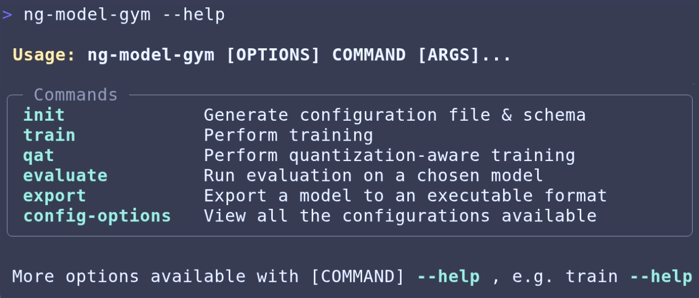

<!---
SPDX-FileCopyrightText: Copyright 2024-2026 Arm Limited and/or its affiliates <open-source-office@arm.com>
SPDX-License-Identifier: Apache-2.0
--->
<h1 align="center">Neural Graphics Model Gym</h1>
<p align="center">
<a href="https://huggingface.co/Arm/neural-super-sampling"></a>
<a href="https://github.com/arm/neural-graphics-model-gym/blob/main/LICENSE.md"></a>


</p>

> [!NOTE]
> Please be aware that this is a beta release. Beta means that the product may not be functionally or feature complete. At this early phase the product is not yet expected to fully meet the quality, testing or performance requirements of a full release. These aspects will evolve and improve over time, up to and beyond the full release. We welcome your feedback.

## Table of contents

1. [Introduction](#introduction)
2. [Quick Start](#quick-start)
    * [Prerequisites](#prerequisites)
    * [Setup](#setup)
    * [Command line usage](#command-line-usage)
    * [Usage as a Python® package](#usage-as-a-python-package)
3. [Monitoring and profiling](#monitoring-and-profiling)
4. [Logging](#logging)
5. [Testing](#testing)
6. [Adding custom models, datasets, and usecases](#adding-custom-models-datasets-and-usecases)
7. [Generating new training data](#generating-new-training-data)
8. [Troubleshooting](#troubleshooting)
9. [Contributions](#code-contributions)
10. [Security](#security)
11. [License](#license)
12. [Trademarks and copyrights](#trademarks-and-copyrights)

## Introduction

**Neural Graphics Model Gym**  is a Python® toolkit for developing real-time Neural Graphics machine learning models.

With **Neural Graphics Model Gym** you can train, finetune and evaluate your Neural Graphics models.
**Neural Graphics Model Gym** also enables you to perform quantization of your model before exporting it to a format compatible with ML extensions for Vulkan® - allowing you to run on the latest mobile devices.

Currently, we include the following Neural Graphics use cases:

* Neural Super Sampling (NSS)
  * NSS allows for high-fidelity, real-time graphics in game engines. By feeding low-resolution frames, along with spatial and motion information, into a neural network we are able to construct high-resolution frames that suffer no loss in quality.

## Quick Start
### Prerequisites

To build and run Neural Graphics Model Gym, the following are required:

* Ubuntu® >= 22.04
  * Neural Graphics Model Gym has been tested on 22.04 LTS and 24.04 LTS, but should work on other Linux® distributions
* 3.10 <= Python < 3.13
* Python development package (e.g. `python3-dev`)
* NVIDIA® CUDA® capable GPU
* CUDA Toolkit v12.8 or later
* Git LFS

### Setup
1. Clone the repository:
```bash
git clone https://github.com/arm/neural-graphics-model-gym.git
```

2. Install the project:
```bash
pip install .
```
For more details including how to install in development mode and how to run using Docker see [setup.md](./docs/setup.md).

### Usage
The neural graphics model gym can be used as a command line tool or by importing it as a Python package. Basic usages are shown here and more detailed commands can be found in [usage.md](./docs/usage.md).

#### Command-line usage
Generate a configuration file:
```bash
ng-model-gym init
```
This file contains configuration options for the different usage modes (training, evaluation, and exporting) and paths to local datasets. Some entries have placeholder values (e.g. "<...>"). Make sure to replace those with your own settings.

Use your custom configuration when invoking CLI commands by providing its path with the `--config-path` or `-c` flag as shown below:

```bash
# Perform model training and evaluation
ng-model-gym --config-path=<path/to/config.json> train
# Evaluate a previously trained model
ng-model-gym -c <path/to/config/file> evaluate --model-path=<path/to/model.pt> --model-type=<fp32|qat_int8>
# Perform quantization aware training (QAT) and evaluation
ng-model-gym -c <path/to/config/file> qat
# Export a trained model to VGF file
ng-model-gym -c <path/to/config/file> export --model-path=<path/to/model.pt> --export-type=<fp32|qat_int8|ptq_int8>
```

The `--config-path` (or `-c`) flag is **required** when running the `train`, `qat`, `evaluate`, or `export` commands.
These commands will fail if a valid config file path is not provided.

If you would like to view and download the available pretrained model, use the following commands:

```bash
ng-model-gym list-models

# ng-model-gym download <repo_name>/<file_name> <destination>
ng-model-gym download neural-super-sampling/nss_v0.1.0_fp32.pt ./myfolder

```

The complete list of CLI commands can be seen by running `ng-model-gym --help` and more detailed information about the commands can be found in [usage.md](./docs/usage.md).

#### Usage as a Python package

The second way to use Neural Graphics Model Gym is to import it as a Python package.

The following snippet shows how to use the package to generate a config, perform training, evaluation and exporting the model.


```python
import ng_model_gym as ngmg

# Generate config file in specified directory using the API or CLI
# Note: The config file must be filled in before use
ngmg.generate_config_file("/save/dir")
```

```python
import ng_model_gym as ngmg
from pathlib import Path

# Create a Config object using path to a configuration file
# and extract parameters from it.
config = ngmg.load_config_file(Path("/path/to/config/file"))

# Enable logging for ng_model_gym
ngmg.logging_config(config)

# Do training and evaluation.
trained_model_path = ngmg.do_training(config, ngmg.TrainEvalMode.FP32)
ngmg.do_evaluate(config, trained_model_path, ngmg.TrainEvalMode.FP32)

# Export the trained fp32 model to a VGF file.
ngmg.do_export(config, trained_model_path, export_type=ngmg.ExportType.FP32)
```

Jupyter® notebook tutorials on how to use the package, including:
* Training
* Quantization-aware training and exporting
* Evaluation
* Fine-tuning
* Adding a custom model

can be found in the [neural-graphics-model-gym-examples](https://github.com/arm/neural-graphics-model-gym-examples) repository.

## Monitoring and profiling
The following tools have been set up to track models during training and to capture performance profiles:
* [TensorBoard](https://www.tensorflow.org/tensorboard)
* Trace profiler
* GPU memory profiler

Their usage is demonstrated in [monitoring-and-profiling.md](./docs/monitoring-and-profiling.md).

## Logging
By default, logging is enabled and set to INFO mode, which will print helpful information during execution.
All logs will be written to an `output.log` file located within the output directory specified in the configuration file.
The logging mode is customizable by using flags with the `ng-model-gym` CLI command. See the options below for examples.

`--log-level=quiet` can be added to silence all logs, except errors.

```bash
ng-model-gym --log-level=quiet -c <path/to/config/file> train
```

`--log-level=debug` can be added to print even more information during the process.

```bash
ng-model-gym --log-level=debug -c <path/to/config/file> train
```

Logging can also be specified when importing the package as follows.

```python
import ng_model_gym as ngmg
from pathlib import Path

# Create a Config object using path to a configuration file
parameters = ngmg.load_config_file(Path("/path/to/config"))

# Enable logging for ng_model_gym
ngmg.logging_config(parameters)
```

## Testing

A collection of unit and integration tests are provided to ensure the functionality of Neural Graphics Model Gym.

Testing can be run using Hatch commands. First [install Hatch and create a dev environment](./docs/setup.md#dev-installation). This will install all the dependencies for Neural Graphics Model Gym, plus the additional dependencies required for testing. The list of testing commands can be found [here](./docs/testing.md).

## Adding custom models, datasets, and usecases

Neural Graphics Model Gym supports adding your own custom models and datasets, enabling you to use them across all workflows. Detailed documentation on how to implement this can be found in [custom-models-and-datasets.md](./docs/adding-custom-models-and-datasets.md#adding-custom-models-and-datasets).

We also support defining new custom use cases to group related models, datasets, configurations, and any additional required code together. See [adding custom usecases](./docs/adding-custom-models-and-datasets.md#adding-custom-use-cases) to see the implementation guide.

## Generating new training data
To train the Neural Super Sampling model, you will first need to capture training data from your game engine in the format expected by the model. Information regarding the types of data to capture and how to convert your captured frames can be found [here](./docs/nss/nss_data_generation.md).

## Troubleshooting
A list of common known issues and their workarounds can be found at [troubleshooting.md](./docs/troubleshooting.md )

## Code contributions
The neural graphics model gym welcomes contributions. For more details on contributing to this project please see the [CONTRIBUTING.md](./CONTRIBUTING.md).

## Security

Arm takes security issues seriously, please see [SECURITY.md](SECURITY.md) for more details.

After following [editable installation with Hatch](./docs/setup.md#dev-installation), you can run the checker for security vulnerabilities with the following command:
```bash
hatch run bandit-check
```

## License

Neural Graphics Model Gym is licensed under [Apache License 2.0](LICENSE.md).

## Trademarks and copyrights

* Linux® is the registered trademark of Linus Torvalds in the U.S. and elsewhere.
* Python® is a registered trademark of the PSF.
* Ubuntu® is a registered trademark of Canonical.
* Docker and the Docker logo are trademarks or registered trademarks of Docker, Inc. in the United States and/or other countries. Docker, Inc. and other parties may also have trademark rights in other terms used herein.
* NVIDIA and the NVIDIA logo are trademarks and/or registered trademarks of NVIDIA Corporation in the U.S. and other countries.
* “Jupyter” and the Jupyter logos are trademarks or registered trademarks of LF Charities.
* Vulkan is a registered trademark and the Vulkan SC logo is a trademark of the Khronos Group Inc.
* Microsoft, Windows are trademarks of the Microsoft group of companies
