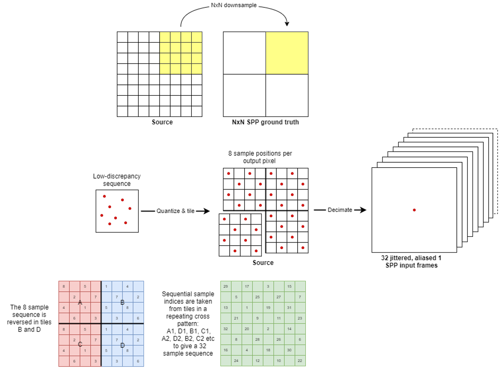

<!---
SPDX-FileCopyrightText: Copyright 2025 Arm Limited and/or its affiliates <open-source-office@arm.com>
SPDX-License-Identifier: Apache-2.0
--->

# NSS Dataset Specification

## Table of Contents

1. [Introduction](#introduction)
2. [Dataset contents](#dataset-contents)
3. [Capture layout](#capture-layout)
    * [Images](#images)
    * [Metadata](#metadata)
      * [Per-sequence](#per-sequence)
      * [Per-frame](#per-frame)
4. [Image sampling](#image-sampling)
5. [Examples](#examples)
    * [Ground truth color (4x4 box filter)](#ground-truth-color-4x4-box-filter)
    * [Ground truth motion (4x4 nearest depth)](#ground-truth-motion-4x4-nearest-depth)
    * [Jittered input decimation](#jittered-input-decimation)
    * [Quantized Halton sequence](#quantized-halton-sequence)


## Introduction

This document describes the specification for data that needs to be captured from your game engine of choice to train Neural Super Sampling (NSS).
Python [scripts](./scripts/safetensors_generator/safetensors_writer.py) included within this repository expect your engine captured data to be in the format described by this document.

## Dataset contents

A dataset comprises a series of ground truth images, which are high-quality images captured at the output target resolution we wish to upscale towards, e.g., 1080p, and input images captured at a variety of resolutions to satisfy different upscaling ratios, e.g., for a `ratio` of 2x2, and a ground truth resolution of 1080p, the input images will be captured at 540p.

In addition to images, the dataset also comprises metadata, which captures the state of the engine at the time that the images were rendered.

## Capture layout
```
<DATASET PATH>/
├── 0000.json
├── 0001.json
├── ...
├── ground_truth/
│   ├── 0000/
│   │   ├── 0000.exr
│   │   ├── 0001.exr
│   │   └── ...
│   ├── 0001/
│   │   ├── 0000.exr
│   │   ├── 0001.exr
│   │   └── ...
│   └── ...
├── motion_gt/
│   ├── 0000/
│   │   ├── 0000.exr
│   │   ├── 0001.exr
│   │   └── ...
│   ├── 0001/
│   │   ├── 0000.exr
│   │   ├── 0001.exr
│   │   └── ...
│   └── ...
└── x{ratio}/
    ├── color/
    │   ├── 0000/
    │   │   ├── 0000.exr
    │   │   ├── 0001.exr
    │   │   └── ...
    │   ├── 0001/
    │   │   ├── 0000.exr
    │   │   ├── 0001.exr
    │   │   └── ...
    │   └── ...
    ├── depth/
    │   ├── 0000/
    │   │   ├── 0000.exr
    │   │   ├── 0001.exr
    │   │   └── ...
    │   ├── 0001/
    │   │   ├── 0000.exr
    │   │   ├── 0001.exr
    │   │   └── ...
    │   └── ...
    └── motion/
        ├── 0000/
        │   ├── 0000.exr
        │   ├── 0001.exr
        │   └── ...
        ├── 0001/
        │   ├── 0000.exr
        │   ├── 0001.exr
        │   └── ...
        └── ...
```

At the root of the dataset you will find the `ground_truth` images, several directories in a per-ratio basis and a JSON file containing metadata for each sequence. Inside these per-ratio directories, each folder will contain a succession of subdirectories based on how many sequences are contained in the dataset, each will contain the generated images in a `.exr` file.

### Images

| Image    | Format | Resolution                | Description | Requirement |
| -------- | ------- |---------------------------| ------- | ------- |
|`ground_truth`|`R16G16B16A16_SFLOAT`| `1920 x 1080`             | Color target rendered natively at 8k, then downsampled to 1080p with a box filter. Stored in linear HDR. | Mandatory |
|`color`|`R16G16B16A16_SFLOAT`| `1920/ratio x 1080/ratio` | Jittered, low resolution color texture before upscaling, stored in linear HDR. | Mandatory |
|`depth`|`R32_SFLOAT` | `1920/ratio x 1080/ratio` | Jittered, low resolution depth texture before upscaling. Preferably forward-Z. | Mandatory |
|`motion`| `R16G16_SFLOAT`| `1920/ratio x 1080/ratio` | Non-Jittered, low resolution velocity texture containing motion information from the frame's velocity texture, stored in UV space.| Mandatory |
|`motion_gt`| `R16G16_SFLOAT`| `1920 x 1080`             | Non-Jittered, output resolution velocity texture containing motion information from the frame's velocity texture, stored in UV space.| Mandatory |

### Metadata

Metadata is split up into two parts "per sequence," which reflects global information that is uniform for all frames within the contiguous sequence, and "per frame" which is information that varies between contiguous frames.

#### Per-sequence

| Metadata    | DTYPE  | Description | Requirement |
| -------- | ------- | ------- | ------- |
|`Version` | `str` | The version of the specification to which the dataset conforms. | Mandatory |
|`EmulatedFramerate` | `int` | The frame rate that the dataset collection tool emulated during capture, e.g., 60. | Mandatory |
|`TargetResolution` | `dict` | An object containing the horizontal and vertical ground truth target resolution e.g., `{"X": 1920,"Y": 1080}` for 1080p. | Mandatory |
|`Samples` | `dict` | An object containing information pertaining to the sampling strategy, number of unique positions, and whether the positions have been quantized when the jittered frame content was captured. e.g., `{"Sequence": "TiledHalton", "Count": 16, "Quantized": true}`. | Mandatory |
|`Frames` | `list` | A list containing the "per-frame" metadata. | Mandatory |
|`ReverseZ` | `bool` | Whether the depth is stored as reversed-Z order. Preferably this should be `false` i.e. forward-Z. | Mandatory |
|`OpaqueOnlyColor_Exported`| `bool` | Whether opaque-only color textures are generated. Used for generating the reactive mask. | Optional |
|`UnjitteredSrcColor_Exported` | `bool` | Whether the unjittered (resampled) color texture has been generated. Useful for debugging jitter vectors. | Optional |
|`UpscalingRatiosIndices`| `dict` | A mapping between upscaling ratio descriptions and the indices used to look up entries in the `NormalizedPerRatioJitter` list for each frame. | Optional |
|`MotionVectorsDilated` | `bool` | Whether the motion vectors have been pre-dilated by the capture application. | Optional |

#### Per-frame

| Metadata    | DTYPE  | Description | Requirement |
| -------- | ------- | ------- | ------- |
|`Frame` | `int` | Frame index. | Mandatory |
|`FovX` | `float` | Horizontal Fov of the camera (radians). | Mandatory |
|`FovY` | `float` | Vertical Fov of the camera (radians). | Mandatory |
|`CameraNearPlane` | `float` | Near plane of the camera in meters. | Mandatory |
|`CameraFarPlane` | `float` | Far plane in meters from the camera. `-1.0` is used to indicate an infinite far plane.| Mandatory |
|`ViewProjection` | `list` | ViewProjection matrix's raw data (`float`, column major). | Mandatory |
|`Jitter` | `dict` | The frame's raw jitter offset in pixels. e.g., `{"X": 0.25, "Y": 0.67}`. | Mandatory |
|`NormalizedPerRatioJitter` | `list` | List containing per-upscaling ratio normalized jitter offsets (i.e. NormalizedPerRatioJitter [x2_index] would be the jitter offset used for decimating the textures in the x2 scenario). Normalized jitter values are the `Jitter {-0.5, 0.5}` divided by the SrcRes (i.e 920x540) | Mandatory |
|`Exposure` | `float` | Exposure value used in the frame for color correction. | Optional |


## Image sampling
> Following this approach is crucial for generating Neural Super Sampling training content.

To capture data from a game engine we render each frame, and corresponding Geometry buffer, at native 8k (`7680 × 4320`) resolution, the same 8K textures are then used to construct both the inputs and ground truth frames for Neural Super Sampling training.

Ground truth frames are constructed by downsampling the 8K textures to 1080p. For ground truth color (`ground_truth` image), we apply a 4x4 box filter, to form a 1080p color texture with 16 samples-per-pixel.
For ground truth motion (`motion_gt` image) we inspect the 8k `depth` image within 4x4 tiles and decimate the motion vector by selecting the vector with the closest depth to the camera within each tile (called dilation).

To generate inputs, we dynamically decimate the 8K textures, based on a jitter vector, to construct jittered Super Sampling input textures. We do this by using a [Halton sequence](https://en.wikipedia.org/wiki/Halton_sequence), where we select (decimate) a single sample within each NxN tile of the 8k textures, e.g., for a 2x2 upscaling ratio, that has a target resolution of 1080p, and an input resolution of 540p, we take a single sample within each 8x8 tile. Tile size can be calculated as follows:

```python
CaptureResolution = (7680, 4320) # 8k
TargetResolution = (1920, 1080) # 1080p
Ratio = (2.0, 2.0)
SrcResolution = int(TargetResolution / Ratio) # (960, 540) 540p
TileSize = CaptureResolution / SrcResolution # (8, 8)
```

This approach is visualized for a given 8x8 tile of an 8k frame in the diagram below.


In this example, the "jitter vector" is used to select an index position within each NxN tile of the source frame, we then apply a decimating point-sample at this index to generate 1 SPP aliased input textures.
The index is calculated by quantizing a low discrepancy sequence, such as Halton sequence.

This methodology ensures the closest possible attainable sample consistency, as both the input and ground truth are derived from the same source, whilst also maintaining a considerable degree of similarity between the 1 SPP aliased input and typical jittered rendering, which is the expected inference-time input.



## Examples

### Ground truth color (4x4 box filter)

For ground truth color (`ground_truth` image), we apply a 4x4 box filter, to form a 1080p color texture with 16 samples-per-pixel.

```cpp
RWTexture2D<float4> _Result;

float3 TonemapKaris(float3 color)
{
    // 1 / (1 + max(rgb)) see https://graphicrants.blogspot.com/2013/12/tone-mapping.html
    return color / (1 + max(max(color.r, color.g), color.b));
}

float3 InvertTonemapKaris(float3 color)
{
	// 1 / (1 - max(rgb))
	return color / (1.0 - max(max(color.r, color.g), color.b));
}

[numthreads(16, 16, 1)] void CSMain(uint3 dispatchThreadId
                                    : SV_DispatchThreadID) {
    uint2 inputIdx = dispatchThreadId.xy * 4;
    float3 color = 0.0f;

    // each 1080p pixel covers a block of 4 x 4 8K pixels
    for (uint y = 0; y < 4; ++y) {
        for (uint x = 0; x < 4; ++x) {
            uint2 idx = inputIdx + uint2(x, y);
            float3 hdr = max(0.0f, LoadCameraColor(idx).rgb);
            float3 tonemapped = TonemapKaris(hdr) / 16.0f;
            color += tonemapped;
        }
    }

    // write out the result in linear HDR
    _Result[dispatchThreadId.xy] = float4(InvertTonemapKaris(color), 1.0);
}
```

### Ground truth motion (4x4 nearest depth)

For ground truth motion (`motion_gt` image) we inspect the 8k `depth` image within 4x4 tiles and decimate the motion vector by selecting the vector with the closest depth to the camera within each tile (called dilation).

```cpp
RWTexture2D<half2> _Result;

[numthreads(16, 16, 1)] void CSMain(uint3 dispatchThreadId
                                    : SV_DispatchThreadID) {
    uint2 inputIdx = dispatchThreadId.xy * 4;
    uint2 closestIdx = inputIdx;
    float maxDepth = 0;

    // Each 1080p pixel covers a block of 4 x 4 8K pixels
    for (uint y = 0; y < 4; ++y) {
        for (uint x = 0; x < 4; ++x) {
            uint2 idx = inputIdx + uint2(x, y);
            float depth = LoadCameraDepth(idx);

            // Some game engines use reverse depth so 1 is near, 0 is far
            if (depth > maxDepth) {
                closestIdx = idx;
                maxDepth = depth;
            }
        }
    }

    _Result[dispatchThreadId.xy] = LoadMotionVectors(closestIdx);
}
```

### Jittered input decimation

Example shows decimation for creating jittered color, the same approach is taken for jittered depth and motion too.

```cpp

RWTexture2D<half4> _Result;

[numthreads(16, 16, 1)] void CSMain(uint3 dispatchThreadId
                                    : SV_DispatchThreadID) {
    uint2 inputIdx = dispatchThreadId.xy;
    float2 coord  = GetTexCoord(inputIdx) + _Jitter.xy;
    float4 color = float4(_CameraColorTexture.Sample(point_clamp_sampler, coord).rgb, 1.0);
    _Result[dispatchThreadId.xy] = color;
}
```

### Quantized Halton sequence

```csharp
Vector2 GenerateRandomOffset(int sampleIndex, int quantGridSize = 8)
{
    Vector2 offset = new Vector2();

    // get offset between 0 and 1
    offset = m_HaltonPoints[sampleIndex];

    if (++sampleIndex >= m_numJitterSamples)
        sampleIndex = 0;

    // optionally quantize
    if (quantGridSize > 1)
    {
        offset.x = (float)((Math.Floor(offset.x * quantGridSize) + 0.5f) / quantGridSize);
        offset.y = (float)((Math.Floor(offset.y * quantGridSize) + 0.5f) / quantGridSize);
    }

    // we want an offset between -0.5 and +0.5 from the centre of the pixel
    offset.x -= 0.5f;
    offset.y -= 0.5f;
    return offset;
}
```
